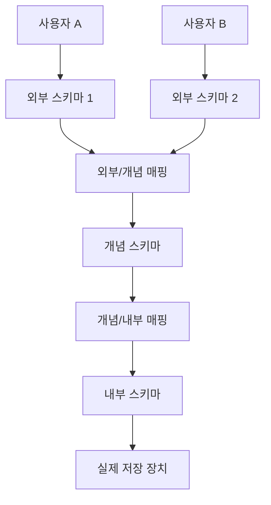

## 1. 데이터베이스 개요 & 데이터 관리

### 데이터베이스(Database) 정의
데이터베이스는 특정 조직의 여러 사용자가 공유하여 사용할 수 있도록 통합해서 저장한 운영 데이터의 집합입니다.

- **통합 데이터(Integrated Data)**: 중복을 최소화하여 효율성을 높인 데이터
- **저장 데이터(Stored Data)**: 컴퓨터가 접근 가능한 매체에 저장된 데이터
- **운영 데이터(Operational Data)**: 조직의 고유 기능을 수행하는 데 반드시 필요한 데이터
- **공유 데이터(Shared Data)**: 여러 사용자가 공동으로 사용하는 데이터

### 데이터베이스 시스템의 특징 (R1C3)
1. **실시간 접근성(Real-time Accessibility)**: 사용자의 질의에 실시간으로 처리하여 응답
2. **계속적인 변화(Continuous Evolution)**: 데이터의 삽입, 삭제, 수정을 통해 항상 최신 상태 유지
3. **동시 공유(Concurrent Sharing)**: 여러 사용자가 동시에 동일한 데이터에 접근 가능
4. **내용 참조(Content Reference)**: 물리적 주소가 아닌 데이터의 값(내용)으로 참조

### 데이터베이스의 장단점
| 장점 (Pros) | 단점 (Cons) |
| :--- | :--- |
| 데이터 중복 최소화 및 저장공간 절약 | 데이터베이스 전문 인력(DBA) 필요 |
| 데이터 공동 활용(Share) 가능 | 시스템 구축 및 운영 비용 부담 |
| 데이터의 일관성, 무결성, 보안성 유지 | 백업 및 복구 대책 마련의 어려움 |
| 데이터의 표준화 및 실시간 동기화 | 대용량 디스크 액세스 집중 시 과부하(Overhead) 발생 |

### 반도체 장비와 데이터베이스
반도체 제조 장비에서는 설비 작동 과정에서 실시간으로 대량의 데이터가 연속적으로 발생하므로, 단순한 엑셀이나 일반 파일로 관리하기 불가능합니다. 이를 효율적으로 처리하기 위해 적합한 특성의 데이터베이스를 적재적소에 활용합니다.

- **데이터 수집 체계**: 데이터 수집 $\rightarrow$ 저장 $\rightarrow$ 가공 $\rightarrow$ 분석 $\rightarrow$ 시각화 $\rightarrow$ 제어/관리
- **데이터(Data) vs 정보(Information)**:
  - **데이터**: 현실 세계에서 관찰하거나 측정하여 수집한 가공되지 않은 사실이나 값 (예: 센서 계측 값)
  - **정보**: 데이터를 처리, 분석하여 의사결정에 유용하게 쓸 수 있도록 만든 결과물
- **데이터의 유형**:
  - **정형 데이터**: 미리 정의된 규칙과 테이블 형태의 구조를 가진 데이터 (RDBMS 테이블)
  - **비정형 데이터**: 일정한 구조가 없는 데이터 (이미지, 설비 로그 텍스트, 바이너리 덤프 등)
  - **범주형 데이터**: 종류를 나타내는 값으로 크기 비교가 불가능한 데이터 (명목형, 순서형)
  - **수치형 데이터**: 숫자 값을 가지며 크기 비교 및 연산이 가능한 데이터 (이산형, 연속형)

### 반도체 데이터 종류별 맞춤형 DB 아키텍처
1. **센서 데이터 (Sensor Data)**:
   - 시간에 따라 지속적으로 대량 축적되는 시계열 데이터(Time Series Data)의 특성을 가집니다.
   - **시계열 데이터베이스 (TSDB, Time Series Database)**를 사용하여 수집 및 압축 저장 속도를 극대화합니다.
2. **비전 이미지 데이터 (Vision Data)**:
   - 비전 카메라가 캡처한 원본 이미지 파일은 파일 서버나 객체 스토리지(Object Storage)에 별도로 저장하고, 관계형 데이터베이스(RDBMS)에는 해당 이미지의 경로, 촬영 시간, 판정 결과 등의 **메타데이터(Metadata)**만 인덱싱하여 관리합니다.
3. **장비 로그 데이터 (Log Data)**:
   - 정형화되지 않은 텍스트 메시지가 빈번하게 발생하므로, 유연한 스키마 구조와 빠른 수평 확장을 제공하는 **NoSQL(Not Only SQL) 데이터베이스**를 활용하여 저장 및 분석합니다. (예: 문서형 데이터베이스인 MongoDB)

---

## 2. 데이터 모델링 & 데이터베이스 구조

### 데이터 모델링 과정
현실 세계의 복잡한 비즈니스 개념을 단순화, 추상화하여 컴퓨터 환경의 데이터베이스로 구축하는 핵심 설계 과정입니다.

1. **요구사항 수집 및 분석**: 사용자 요구사항 분석 및 명세서 작성
2. **개념적 모델링 (Conceptual)**: 비즈니스 도메인의 중요 개념과 관계를 도출하여 **ERD(Entity Relationship Diagram)** 작성
3. **논리적 모델링 (Logical)**: ERD를 실제 RDBMS 테이블 구조에 맞게 사상(Mapping)하고, 속성 정의 및 테이블 **정규화(Normalization)** 수행
4. **물리적 모델링 (Physical)**: 구체적인 DBMS 제품군에 맞추어 인덱스 설계, 파티셔닝, 물리적 테이블 공간 생성
5. **데이터베이스 구현 (Implementation)**: DDL을 실행하여 실제 테이블, 뷰, 인덱스 생성

### 개체-관계 모델 (ERD) & 관계 데이터 모델 용어
- **개체(Entity)**: 독립적으로 존재하며 서로 구별 가능한 사람, 사물 또는 개념
- **속성(Attribute)**: 개체나 관계가 가진 고유한 특성 (열, Field)
- **관계(Relationship)**: 개체 간의 의미 있는 연관성 (1:1, 1:N, N:M)

#### 관계 데이터 모델 용어 비교 매핑
| 논리적 모델 (SQL) | 관계 대수 (Relational Algebra) | 파일 시스템 (File System) |
| :--- | :--- | :--- |
| **테이블 (Table)** | 릴레이션 (Relation) | 파일 (File) |
| **행 (Row)** | 튜플 (Tuple) | 레코드 (Record) |
| **열 (Column)** | 속성 (Attribute) | 필드 (Field) |

- **도메인(Domain)**: 하나의 속성이 가질 수 있는 모든 원자값(Atomic Value)의 집합 (데이터 타입 및 제약 조건의 기준)
- **차수(Degree)**: 하나의 테이블에 속한 열(Attribute)의 개수
- **카디널리티(Cardinality)**: 하나의 테이블에 존재하는 행(Tuple)의 개수
- **릴레이션 인스턴스**: 특정 시점에 테이블에 저장되어 있는 데이터 행들의 집합

#### 릴레이션(Relation)의 6대 특징
1. 속성은 단일 값을 가짐 (원자성)
2. 속성은 서로 다른 이름을 가짐
3. 한 속성의 값은 모두 같은 도메인에 속함
4. 테이블 내에 완전히 중복된 행(Tuple)은 허용되지 않음
5. 열(Attribute)의 순서는 상관없음
6. 행(Tuple)의 순서는 상관없음

### 데이터베이스 3단계 스키마 구조
데이터베이스에 대한 관점을 사용자, 조직 전체, 물리적 저장 장치로 구분하여 데이터 독립성을 확보하는 아키텍처입니다.



- **외부 스키마 (External Schema)**: 각 개별 사용자나 응용 프로그램 관점의 데이터 정의 (서브 스키마, 여러 개 존재 가능)
- **개념 스키마 (Conceptual Schema)**: 조직 전체의 통합된 관점의 데이터 정의 (보안 정책, 제약조건, 관계 정의 포함, 단 하나만 존재)
- **내부 스키마 (Internal Schema)**: 물리적 저장 장치 관점의 구조 정의 (필드 크기, 인덱스 물리 구조, 레코드 형식 정의, 단 하나만 존재)

### 데이터 독립성 (Data Independence)
하위 스키마를 변경하더라도 상위 스키마가 영향을 받지 않는 구조적 특성입니다.

- **논리적 데이터 독립성**: 개념 스키마가 변경되어도 외부 스키마가 영향을 받지 않음 (외부/개념 매핑 또는 응용 인터페이스만 수정)
- **물리적 데이터 독립성**: 내부 스키마(물리 구조)가 변경되어도 개념 스키마가 영향을 받지 않음 (개념/내부 매핑 또는 저장 인터페이스만 수정)

---

## 3. 키 & 무결성 제어

### 키(Key)의 개념과 종류
테이블 내에서 특정 행을 유일하게 구별하거나 테이블 간의 관계를 맺어주기 위한 도구입니다.

- **슈퍼키(Super Key)**: 행을 유일하게 구별할 수 있는 속성 또는 속성들의 집합 (**유일성**은 만족하지만 **최소성**은 만족하지 않음)
- **후보키(Candidate Key)**: 행을 유일하게 식별할 수 있는 최소한의 속성 집합 (**유일성**과 **최소성**을 모두 만족)
- **기본키(Primary Key)**: 후보키 중 설계자에 의해 최종 선택된 식별 키 (밑줄로 표시, NULL 불가, 중복 불가)
- **대체키(Alternate Key)**: 후보키 중 기본키로 선택받지 못한 나머지 키들
- **외래키(Foreign Key)**: 다른 테이블의 기본키를 참조하는 속성 (테이블 간의 참조 관계를 정의)

### 데이터 무결성 제약조건 (Integrity Constraints)
데이터베이스에 저장된 데이터의 정확성과 일관성을 지키기 위한 강제 제약 규칙입니다.

1. **도메인 무결성(Domain Integrity)**: 모든 속성 값은 정의된 데이터 타입, 범위, DEFAULT 등의 도메인 규칙을 준수해야 함
2. **개체 무결성(Entity Integrity)**: 기본키 속성은 절대 NULL이 될 수 없으며 중복되어서도 안 됨
3. **참조 무결성(Referential Integrity)**: 외래키 값은 참조하는 대상 테이블의 기본키 값으로 존재하는 값이거나 NULL이어야 함

### 참조 무결성을 유지하기 위한 외래키 제약조건 옵션
참조 대상인 부모 테이블의 데이터가 삭제(`ON DELETE`)되거나 수정(`ON UPDATE`)될 때 자식 테이블 데이터를 어떻게 제어할지 지정하는 제약조건입니다.

- **CASCADE**: 부모 테이블의 데이터를 삭제/수정하면, 이를 참조하는 자식 테이블의 데이터도 자동으로 함께 삭제/수정됩니다.
- **SET NULL**: 부모 테이블의 데이터가 삭제/수정되면, 자식 테이블의 외래키 값을 NULL로 변경합니다. (자식 테이블의 해당 컬럼이 NULL 허용이어야 함)
- **RESTRICT**: 자식 테이블이 참조하고 있는 경우, 부모 테이블 데이터의 삭제/수정을 사전에 거부(에러 발생)합니다.
- **NO ACTION**: 아무런 자동 변경 작업도 취소하지 않으나, 트랜잭션 종료 시 제약조건 위반 검사를 실행하여 어긋나면 작업을 롤백합니다. (MySQL 등 대부분의 DB에서 RESTRICT와 유사하게 동작)

---

## 4. SQL 개요 및 DDL (데이터 정의어)

### SQL 분류
- **DDL (Data Definition Language)**: 테이블, 뷰, 인덱스 등 데이터 구조를 생성, 변경, 삭제 (`CREATE`, `ALTER`, `DROP`, `TRUNCATE`)
- **DML (Data Manipulation Language)**: 테이블 내의 실제 데이터를 추가, 조회, 수정, 삭제 (`INSERT`, `SELECT`, `UPDATE`, `DELETE`)
- **DCL (Data Control Language)**: 트랜잭션 제어 및 계정 권한 부여 (`GRANT`, `REVOKE`, `COMMIT`, `ROLLBACK`)

### 주요 데이터 형식 (Data Types)
- **정수형**: `INT` (4바이트)
- **실수형**:
  - 부동 소수점 (정밀도 우선): `FLOAT` (4바이트), `DOUBLE` (8바이트)
  - 고정 소수점 (금융/수치 계산용): `DECIMAL(P, D)` (P: 전체 자릿수, D: 소수점 이하 자릿수)
- **문자형**:
  - `CHAR(N)`: 고정 길이 문자형. 지정 크기보다 작은 값을 넣어도 남은 공간을 공백으로 유지
  - `VARCHAR(N)`: 가변 길이 문자형. 사용된 바이트만 소모하고 남은 공간은 시스템에 반환하여 공간 절약
- **날짜/시간형**: `DATE`, `TIME`, `DATETIME`, `TIMESTAMP`
- **논리형**: `BOOLEAN` (True = 1, False = 0으로 매핑)

### DDL 실무 쿼리 예제

#### 데이터베이스 생성 및 삭제
```sql
SHOW DATABASES;          -- 현재 생성된 데이터베이스 목록 출력
CREATE DATABASE ShopDB;  -- ShopDB 데이터베이스 생성
USE ShopDB;              -- ShopDB 사용 선언
DROP DATABASE ShopDB;    -- ShopDB 데이터베이스 삭제
```

#### 테이블 생성 (Constraints 포함)
```sql
CREATE TABLE students (
    id INT AUTO_INCREMENT PRIMARY KEY,   -- 기본키 지정 및 자동 증가 설정
    name VARCHAR(50) NOT NULL,
    email VARCHAR(100) UNIQUE,           -- 중복 방지 고유키 설정
    major VARCHAR(50) DEFAULT '미정'     -- 기본값 지정
);

CREATE TABLE borrow (
    borrow_id INT AUTO_INCREMENT,
    student_id INT,
    book_id INT,
    borrow_date DATE NOT NULL,
    PRIMARY KEY (borrow_id),
    -- 외래키 지정 및 참조 무결성 옵션 설정 (CASCADE)
    FOREIGN KEY (student_id) REFERENCES students(id) ON DELETE CASCADE
);
```

#### ALTER TABLE (테이블 구조 변경)
```sql
-- 테이블 이름 변경
ALTER TABLE students RENAME TO user_students;

-- 컬럼 추가
ALTER TABLE user_students ADD phone VARCHAR(20);

-- 컬럼 삭제
ALTER TABLE user_students DROP COLUMN phone;

-- 컬럼 이름 및 속성 변경
ALTER TABLE user_students CHANGE name student_name VARCHAR(60) NOT NULL;

-- 컬럼 데이터 타입 및 제약조건 단독 변경
ALTER TABLE user_students MODIFY student_name VARCHAR(100) NOT NULL;

-- 외래키 제약조건 제거 및 추가
ALTER TABLE borrow DROP CONSTRAINT fk_student_id;
ALTER TABLE borrow ADD CONSTRAINT fk_student_id FOREIGN KEY (student_id) REFERENCES user_students(id) ON DELETE SET NULL;
```

---

## 5. SQL DML (데이터 조작어)

### DML 기초 (삽입, 수정, 삭제)
```sql
-- 데이터 대입 (단일 및 다중 다중 행 삽입 가능)
INSERT INTO students (name, email, major) VALUES ('홍길동', 'hong@test.com', '컴퓨터공학');
INSERT INTO students (name, email, major) VALUES 
('박태환', 'park@swimming.com', '체육학'),
('기보배', 'ki@archery.com', '체육학');

-- 데이터 수정
UPDATE students SET major = '데이터베이스' WHERE id = 1;

-- 데이터 삭제
DELETE FROM students WHERE id = 2;
```

> [!WARNING]
> **SQL Safe Updates Mode (안전 모드)**
> MySQL에서는 기본적으로 PK 컬럼이 포함되지 않은 일반 조건으로 `UPDATE`나 `DELETE`를 실행하면 차단되는 안전 모드가 활성화되어 있습니다. 임시로 이 기능을 끄고 대량 처리를 하고자 할 때는 다음과 같이 설정합니다.
> ```sql
> SET SQL_SAFE_UPDATES = 0; -- 안전 모드 해제
> -- 쿼리 실행...
> SET SQL_SAFE_UPDATES = 1; -- 안전 모드 복구
> ```

### SELECT 절 기본 및 조건 연산자
```sql
-- 테이블 전체 컬럼 조회
SELECT * FROM students;

-- 일부 컬럼 조회 및 별칭(AS) 설정
SELECT name AS '학생 이름', email AS '이메일' FROM students;

-- 중복 제거 조회
SELECT DISTINCT major FROM students;

-- 복합 조건 검색 (AND, OR, 비교연산자)
SELECT * FROM students WHERE major = '체육학' AND id > 1;

-- 범위 검색 (BETWEEN ... AND ...)
-- 주의: 시작 및 끝 값을 모두 포함하는 폐구간 범위 검색
SELECT * FROM books WHERE published_year BETWEEN 1990 AND 2020;

-- 포함 여부 검색 (IN)
SELECT * FROM students WHERE major IN ('컴퓨터공학', '데이터베이스');

-- 부분 검색 및 와일드카드 (LIKE)
-- % : 글자 수 제한 없는 와일드카드, _ : 임의의 1글자 매핑
SELECT * FROM students WHERE name LIKE '김%';      -- '김'으로 시작하는 이름
SELECT * FROM students WHERE name LIKE '김_';      -- '김'으로 시작하는 외자 이름
SELECT * FROM students WHERE email LIKE '%\_%';    -- 언더바(_)가 포함된 이메일 (Escape 필요)
SELECT * FROM students WHERE email LIKE '%!_%' ESCAPE '!'; -- 임의의 Escape 문자 지정 가능

-- NULL 조건 검색
SELECT * FROM students WHERE email IS NULL;
SELECT * FROM students WHERE email IS NOT NULL;
```

### 정렬 및 출력 개수 제어 (ORDER BY, LIMIT, OFFSET)
```sql
-- 정렬 (ASC 오름차순, DESC 내림차순, 기본값은 ASC)
SELECT * FROM students ORDER BY name ASC, id DESC;

-- 출력 개수 제한 및 오프셋 건너뛰기
SELECT * FROM students ORDER BY id DESC LIMIT 5;            -- 상위 5개 데이터 출력
SELECT * FROM students ORDER BY id DESC LIMIT 3 OFFSET 2;   -- 2개 건너뛰고 3개 데이터 출력 (3등 ~ 5등)
```

### 집계 함수 및 그룹화 (GROUP BY, HAVING)
```sql
-- 집계 함수 사용
SELECT COUNT(*) AS '전체 학생 수', AVG(age) AS '평균 나이' FROM students;

-- 그룹화 및 그룹 조건 제한
-- WHERE절은 그룹화 이전에 원본 데이터 필터링 시 사용되고, HAVING절은 그룹화 이후 결과에 필터링을 적용합니다.
SELECT major, COUNT(*) AS '학생수', AVG(age) AS '평균나이'
FROM students
WHERE age >= 20
GROUP BY major
HAVING COUNT(*) >= 2
ORDER BY '평균나이' DESC;
```

### 🌟 SQL 문법 작성 순서와 실제 실행(수행) 절차 비교
SQL 문을 작성할 때의 논리적인 구조와 데이터베이스 엔진 내부에서 효율적인 쿼리 수행을 위해 처리하는 내부 실행 절차는 다릅니다. 이 순서를 올바르게 이해해야 최적의 성능을 낼 수 있는 쿼리를 설계할 수 있습니다.

| 순서 | SQL 작성 순서 (Syntax Order) | 데이터베이스 내부 실행(수행) 순서 (Execution Order) |
| :---: | :--- | :--- |
| **1** | `SELECT` | **FROM** (대상 테이블 로드) |
| **2** | `FROM` | **ON / JOIN** (조인 테이블 병합 및 연결 조건 평가) |
| **3** | `JOIN` | **WHERE** (일반 조건에 따른 개별 행 필터링) |
| **4** | `WHERE` | **GROUP BY** (지정 컬럼 기준 데이터 그룹화) |
| **5** | `GROUP BY` | **HAVING** (그룹 집계에 따른 그룹 필터링) |
| **6** | `HAVING` | **SELECT** (조회 속성 연산 및 별칭 부여, 중복 제거 DISTINCT) |
| **7** | `ORDER BY` | **ORDER BY** (최종 결과 정렬) |
| **8** | `LIMIT` | **LIMIT / OFFSET** (일부 데이터 추출) |

- **집계 함수의 특징**: `COUNT`, `SUM`, `AVG` 등 집계 함수는 `HAVING`절, `SELECT`절, `ORDER BY`절에서는 사용할 수 있으나 `WHERE`절 내부에서는 연산 순서상 불가능합니다. (개별 행 필터링 단계인 `WHERE` 단계에서는 전체 그룹의 집계 값이 존재하지 않기 때문)

---

## 6. 고급 SQL 기능

### 다양한 조인(JOIN) 유형
두 개 이상의 테이블을 연결하여 통합된 데이터 결과를 가져오는 질의 방법입니다.

```
1. INNER JOIN (교집합)
[Table A] ──∩── [Table B]

2. LEFT JOIN (왼쪽 기준 외부조인)
[Table A (All)] ──∪── [Table B (Matching only)]
```

- **INNER JOIN**: 두 테이블의 조인 연결 컬럼 값이 일치하는 행들만 매칭하여 출력
```sql
SELECT s.student_name, b.title
FROM user_students AS s
INNER JOIN borrow AS br ON s.id = br.student_id
INNER JOIN books AS b ON br.book_id = b.id;
```
- **LEFT JOIN / RIGHT JOIN**: 기준 테이블(LEFT는 FROM측, RIGHT는 JOIN측)의 모든 데이터를 출력하고 대상 테이블에 매칭 값이 없으면 NULL로 채움
```sql
SELECT s.student_name, br.borrow_date
FROM user_students AS s
LEFT JOIN borrow AS br ON s.id = br.student_id;
```
- **CROSS JOIN**: 두 테이블 간의 가능한 모든 조합의 데이터 집합 출력 (카테시안 곱, Cartesian Product)
- **조인 작성 팁**: FROM 절에는 가장 기준이 되는 주요 부모 테이블을 먼저 기재하는 것이 설계상 직관적이며 가독성을 높입니다.

### 서브쿼리 (Subquery)
하나의 SQL 질의문 안에 포함된 또 다른 SELECT 문입니다.

- **단일 행 서브쿼리**: 서브쿼리 결과가 단 1건만 반환되는 형태
```sql
SELECT * FROM students WHERE age = (SELECT MAX(age) FROM students);
```
- **다중 행 서브쿼리 (IN 사용)**: 서브쿼리가 여러 행의 값을 집합으로 반환하는 형태
```sql
SELECT * FROM students WHERE id IN (
    SELECT student_id FROM borrow WHERE book_id IN (
        SELECT id FROM books WHERE published_year >= 2020
    )
);
```
- **인라인 뷰 (Inline View)**: FROM 절에 위치하여 하나의 임시 테이블처럼 동작하는 서브쿼리 (반드시 별칭을 지정해야 함)
```sql
SELECT sub.major, sub.avg_age
FROM (
    SELECT major, AVG(age) AS avg_age FROM students GROUP BY major
) AS sub
WHERE sub.avg_age >= 25;
```

### 뷰 (View)
복잡하거나 자주 사용하는 쿼리 결과를 가상의 테이블로 정의하여 편의성과 보안성을 강화하는 기능입니다.

```sql
-- 뷰 생성
CREATE VIEW student_borrow_summary AS
SELECT s.student_name, COUNT(br.borrow_id) AS borrow_count
FROM user_students AS s
LEFT JOIN borrow AS br ON s.id = br.student_id
GROUP BY s.id;

-- 뷰 확인
SELECT * FROM student_borrow_summary WHERE borrow_count >= 2;

-- 뷰 목록 조회
SHOW FULL TABLES WHERE table_type = 'VIEW';

-- 뷰 삭제
DROP VIEW student_borrow_summary;
```

### 인덱스 (Index)
데이터 조회를 고속화하기 위해 특정 열을 기준으로 색인을 생성하는 기능입니다.

- **인덱스 대상 지정 기준**:
  - `WHERE` 조건절에서 검색 빈도가 매우 높은 열
  - `JOIN` 조건으로 참조 관계에 결합되는 열
  - `ORDER BY` 나 `GROUP BY` 작업이 자주 적용되는 열
- **인덱스 주의사항**:
  - 너무 많은 인덱스를 생성하면 `INSERT`, `UPDATE`, `DELETE` 시마다 색인 구조를 재구성하므로 전반적인 CUD 성능이 저하됩니다.
  - 데이터의 고유 식별 수준(선택도, Cardinality)이 높은 열에 설정해야 검색 가속 효과를 얻을 수 있습니다.
  - 기본키(`PRIMARY KEY`)나 고유키(`UNIQUE`)를 추가하면 인덱스는 데이터 정밀 검사를 위해 DBMS 내부에서 자동으로 생성됩니다.
```sql
-- 인덱스 생성
CREATE INDEX idx_student_name ON user_students(student_name);

-- 테이블 내 인덱스 구조 조회
SHOW INDEX FROM user_students;

-- 인덱스 삭제
DROP INDEX idx_student_name ON user_students;
```

### 실행 계획 (Explain Plan)
데이터베이스 내부 옵티마이저가 작성한 쿼리 수행 프로세스를 사전 분석하는 방법입니다.
```sql
EXPLAIN SELECT * FROM user_students WHERE student_name = '홍길동';
```

### 정규 표현식 (REGEXP) 검색
`LIKE`보다 훨씬 유연하고 강력한 특정 패턴의 텍스트 매칭 검색 기능입니다.
```sql
-- 'A'로 시작하는 이름을 가진 유저 조회
SELECT * FROM users WHERE name REGEXP '^A';

-- 'son'으로 끝나는 이름을 가진 유저 조회
SELECT * FROM users WHERE name REGEXP 'son$';

-- 'abc' 또는 'def' 문자열을 포함하는 레코드 조회
SELECT * FROM products WHERE description REGEXP 'abc|def';

-- 응용: 숫자로 시작하는 글을 우선 정렬하고 나머지를 이름순 정렬
SELECT title FROM posts ORDER BY (title REGEXP '^[0-9]') DESC, title ASC;
```
