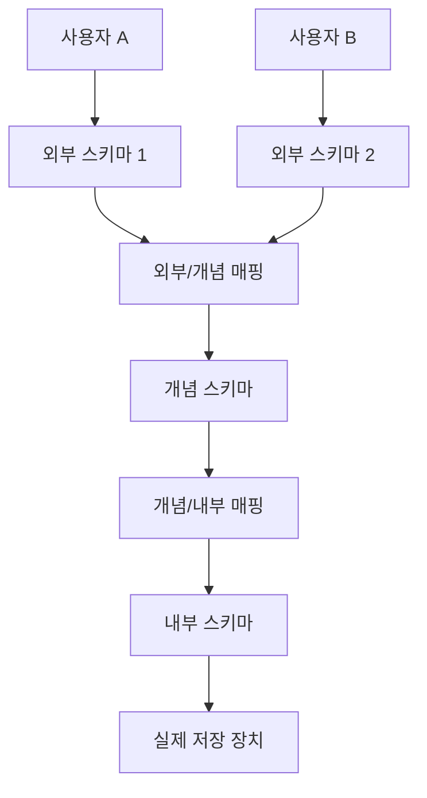

### 02. 데이터 모델링 & 데이터베이스 구조

### 데이터 모델링 과정
현실 세계의 복잡한 비즈니스 개념을 단순화, 추상화하여 컴퓨터 환경의 데이터베이스로 구축하는 핵심 설계 과정입니다.

1. **요구사항 수집 및 분석**: 사용자 요구사항 분석 및 명세서 작성
2. **개념적 모델링 (Conceptual)**: 비즈니스 도메인의 중요 개념과 관계를 도출하여 **ERD(Entity Relationship Diagram)** 작성
3. **논리적 모델링 (Logical)**: ERD를 실제 RDBMS 테이블 구조에 맞게 사상(Mapping)하고, 속성 정의 및 테이블 **정규화(Normalization)** 수행
4. **물리적 모델링 (Physical)**: 구체적인 DBMS 제품군에 맞추어 인덱스 설계, 파티셔닝, 물리적 테이블 공간 생성
5. **데이터베이스 구현 (Implementation)**: DDL을 실행하여 실제 테이블, 뷰, 인덱스 생성

### 개체-관계 모델 (ERD) & 관계 데이터 모델 용어
- **개체(Entity)**: 독립적으로 존재하며 서로 구별 가능한 사람, 사물 또는 개념
- **속성(Attribute)**: 개체나 관계가 가진 고유한 특성 (열, Field)
- **관계(Relationship)**: 개체 간의 의미 있는 연관성 (1:1, 1:N, N:M)

#### 관계 데이터 모델 용어 비교 매핑
| 논리적 모델 (SQL) | 관계 대수 (Relational Algebra) | 파일 시스템 (File System) |
| :--- | :--- | :--- |
| **테이블 (Table)** | 릴레이션 (Relation) | 파일 (File) |
| **행 (Row)** | 튜플 (Tuple) | 레코드 (Record) |
| **열 (Column)** | 속성 (Attribute) | 필드 (Field) |

- **도메인(Domain)**: 하나의 속성이 가질 수 있는 모든 원자값(Atomic Value)의 집합 (데이터 타입 및 제약 조건의 기준)
- **차수(Degree)**: 하나의 테이블에 속한 열(Attribute)의 개수
- **카디널리티(Cardinality)**: 하나의 테이블에 존재하는 행(Tuple)의 개수
- **릴레이션 인스턴스**: 특정 시점에 테이블에 저장되어 있는 데이터 행들의 집합

#### 릴레이션(Relation)의 6대 특징
1. 속성은 단일 값을 가짐 (원자성)
2. 속성은 서로 다른 이름을 가짐
3. 한 속성의 값은 모두 같은 도메인에 속함
4. 테이블 내에 완전히 중복된 행(Tuple)은 허용되지 않음
5. 열(Attribute)의 순서는 상관없음
6. 행(Tuple)의 순서는 상관없음

### 데이터베이스 3단계 스키마 구조
데이터베이스에 대한 관점을 사용자, 조직 전체, 물리적 저장 장치로 구분하여 데이터 독립성을 확보하는 아키텍처입니다.

- **외부 스키마 (External Schema)**: 각 개별 사용자나 응용 프로그램 관점의 데이터 정의 (서브 스키마, 여러 개 존재 가능)
- **개념 스키마 (Conceptual Schema)**: 조직 전체의 통합된 관점의 데이터 정의 (보안 정책, 제약조건, 관계 정의 포함, 단 하나만 존재)
- **내부 스키마 (Internal Schema)**: 물리적 저장 장치 관점의 구조 정의 (필드 크기, 인덱스 물리 구조, 레코드 형식 정의, 단 하나만 존재)

### 데이터 독립성 (Data Independence)
하위 스키마를 변경하더라도 상위 스키마가 영향을 받지 않는 구조적 특성입니다.

- **논리적 데이터 독립성**: 개념 스키마가 변경되어도 외부 스키마가 영향을 받지 않음 (외부/개념 매핑 또는 응용 인터페이스만 수정)
- **물리적 데이터 독립성**: 내부 스키마(물리 구조)가 변경되어도 개념 스키마가 영향을 받지 않음 (개념/내부 매핑 또는 저장 인터페이스만 수정)

---